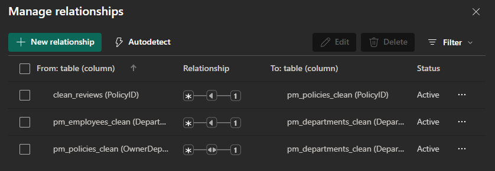

# Policy Review Dashboards

## Overview
This project demonstrates a series of Power BI dashboards built to answer key governance and compliance questions from different stakeholder perspectives.

The dashboards will be developed in stages. The first completed view, **Board of Directors Dashboard**, is included below. Additional dashboards for **Compliance Managers** and **Supervisors or Policy Owners** will be added over time.

---

## Dashboard 1: Board of Directors

### Business Question
“Are we keeping policies up to date, and which departments are falling behind?”

### Dashboard Preview

**Key Features**
- **KPI Cards**
  - Total Policies
  - Policies On Time (percent), with conditional formatting against benchmarks:
    - Red: below 90 percent
    - Yellow: 90 to 95 percent
    - Green: above 95 percent
  - Overdue Policies
- **Department Performance**
  - One hundred percent stacked bar chart showing percentage of policies reviewed on time by department
  - Benchmark line set at 90 percent for quick comparison
- **Lowest Performing Departments**
  - Table highlighting the five departments with the lowest on time percentages
  - Columns include total policies, overdue policies, and on time percentage with conditional formatting
- **Trend Analysis**
  - Line chart showing quarterly review activity from 2019 to 2024
- **Interactive Filters**
  - Policy Type
  - Review Date

---

## Dashboard 1 Analysis

Based on the current visualization:

1. **Department Performance**
   - **Lowest Performing Department**: Risk Management, with an on time review rate of 78.95 percent.
   - **Highest Performing Departments**: Accounting, Employer Services, Internal Audit, and Legal Affairs, each at 100 percent on time.

2. **Overall On Time Percentage**
   - The overall on time review rate is 93.3 percent, which exceeds the 90 percent minimum benchmark.
   - It is slightly below the 95 percent “green” target, indicating that while most departments are compliant, targeted improvement is needed in specific areas.

3. **Policy Review Trend 2019 to 2024**
   - Review activity averages roughly 70 to 100 reviews per quarter.
   - Quarter 1 of 2019 shows the highest spike, exceeding 100 reviews, which may represent a catch up period or a cycle of policy expirations.
   - Periodic dips, for example late 2020 and early 2023, suggest seasonal or cyclical fluctuations in review activity.

4. **Lowest Performing Departments Table**
   - Risk Management and Investment Operations fall below the 90 percent threshold.
   - Communications, Facilities, and Member Services are slightly above 90 percent but still below the green threshold, warranting closer monitoring.

---

## Data Model

The dashboards are supported by four cleaned datasets located in the `data/` folder:

- **Policies** [pm_policies_clean.csv](../data/pm_policies_clean.csv)
- **Reviews** [pm_reviews_clean.csv](../data/pm_reviews_clean.csv)
- **Departments** [pm_departments_clean.csv](../data/pm_departments_clean.csv)
- **Employees** [pm_employees_clean.csv](../data/pm_employees_clean.csv) 

### Schema View
 

### Relationships

**Relationships established:**
- **Policies and Reviews**: One to Many  
  One policy can have many reviews.
- **Departments and Policies**: One to Many  
  One department can own many policies.
- **Departments and Employees**: One to Many  
  One department can have many employees.
- **Employees and Reviews**: One to Many  
  One employee, the reviewer, can complete many reviews.

These relationships ensure that performance metrics can be rolled up accurately from individual reviews to employees, and from policies to departments.

---

## Business Value
The dashboards are designed to provide stakeholders with:
- **Executives and Board**
  - Are policies being reviewed on time across the organization?
  - How many policies are currently overdue?
  - Which departments consistently meet compliance standards and which ones lag behind?
- **Managers**
  - Which supervisors or departments are responsible for the highest number of overdue policies?
  - What percentage of reviews are being completed on time within each department?
  - How is review activity trending over the past five years?
- **Compliance Teams**
  - Where are overdue items concentrated by department?
  - How does on time performance vary by department and over time?
  - What is the overall volume of reviews completed across quarters?

---

## Future Dashboards
- **Compliance Manager Dashboard**  
  Focus on review process performance, reviewer timeliness, and outcomes.
- **Supervisor or Policy Owner Dashboard**  
  Focus on workload, upcoming deadlines, and department level accountability.
